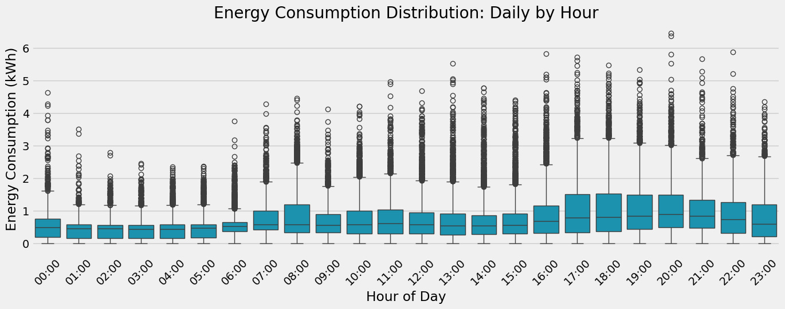
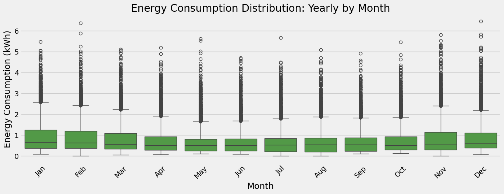
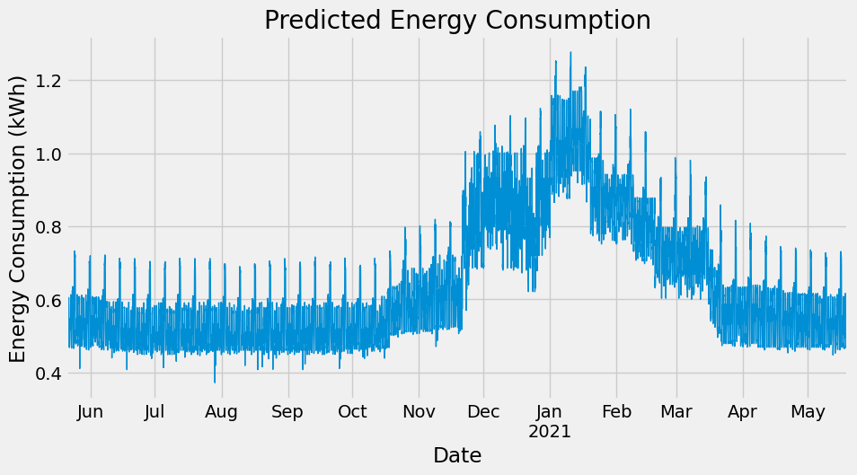
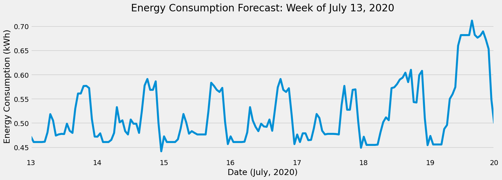
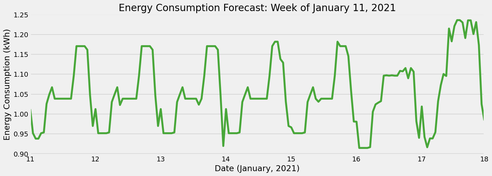

##### Thursday the 5th of September, 2024
# BCHydro Energy Consumption Forecast with XGBoost

## Introduction
### Background

In British Columbia, BCHydro supplies over 95% of the population's electricity, primarily through renewable hydroelectric power. As the province's main energy provider, the utility company plays a key role in maintaining reliable energy access, powering industries, and sustaining vital infrastructure, all while promoting environmental stewardship and energy efficiency.

The ability for BCHydro to execute reliable and accurate energy demand forecasting is essential for efficient management and planning of power generation, distribution, and consumption. In general, predicting energy demand is a challenging task, as it is shaped by various factors such as weather conditions, economic trends, and societal behaviors. This project explores the development of a forecasting model using machine learning techniques to predict future energy demand.

### Objective

 The goal of this project is to employ the XGBoost library and cross-validation techniques in developing a machine learning model that can predict/estimate future energy consumption levels based on historical BCHydro time-series data. 


## Dataset description
The dataset used in this project is called [The Hourly Usage of Energy Dataset for Buildings in British Columbia](https://dataverse.harvard.edu/dataset.xhtml?persistentId=doi:10.7910/DVN/N3HGRN&version=5.0&selectTab=termsTab).

This dataset consists of hourly energy consumption data in kilowatts per hour, donated by residential customers of BCHydro, the primary provincial power utility company of British Columbia, Canada. The sample contains data from 22 homes, the majority of which have 3 years of historical consumption data as limited by the BCHydro customer portal from which the data was sourced.

The date range in which data is present is from June 1, 2012 to May 19, 2020

<table border="1" class="dataframe">
  <thead>
    <tr style="text-align: right;">
      <th></th>
      <th>energy_kWh</th>
    </tr>
    <tr>
      <th>datetime</th>
      <th></th>
    </tr>
  </thead>
  <tbody>
    <tr>
      <th>2012-06-01 01:00:00</th>
      <td>1.011</td>
    </tr>
    <tr>
      <th>2012-06-01 02:00:00</th>
      <td>0.451</td>
    </tr>
    <tr>
      <th>2012-06-01 03:00:00</th>
      <td>0.505</td>
    </tr>
    <tr>
      <th>2012-06-01 04:00:00</th>
      <td>0.441</td>
    </tr>
    <tr>
      <th>2012-06-01 05:00:00</th>
      <td>0.468</td>
    </tr>
    <tr>
      <th>...</th>
      <td>...</td>
    </tr>
    <tr>
      <th>2020-05-19 19:00:00</th>
      <td>3.060</td>
    </tr>
    <tr>
      <th>2020-05-19 20:00:00</th>
      <td>2.940</td>
    </tr>
    <tr>
      <th>2020-05-19 21:00:00</th>
      <td>1.970</td>
    </tr>
    <tr>
      <th>2020-05-19 22:00:00</th>
      <td>2.130</td>
    </tr>
    <tr>
      <th>2020-05-19 23:00:00</th>
      <td>1.010</td>
    </tr>
  </tbody>
</table>
</div>


----


## Python Modules
The following python libraries were used in this project:

- pandas
- numpy
- matplotlib
- seaborn
- Scikit-learn
- datetime
- math

---
## Exploratory Data Analysis
### Data Visualization
First, let's take a look at all of the energy consumption data across all available dates:

    

    


---
## Time Series Cross-Validation
    

    


---
## Feature Engineering
For a more robust predictive analysis, we create and employ a function to add a number of time-based features to our data, as derived from the datetime index in our dataframe. The added features are as follows:
- `hour`
- `dayofweek`
- `quarter`
- `month`
- `year`
- `dayofyear`

The code below creates our function:


```python
def make_features(data):
    data = data.copy()
    data["hour"] = data.index.hour
    data["dayofweek"] = data.index.dayofweek
    data["quarter"] = data.index.quarter
    data["month"] = data.index.month
    data["year"] = data.index.year
    data["dayofyear"] = data.index.dayofyear
    return data
```


### Visualizing Feature Relationships

Next, we will create two box plots to we will visualize the relationship between our newly added `hour` and `month` features and energy consumption. These visualizations allow us to view the distribution of energy consumption throughout the hours of the day, and throughout the months of the year.

    



    


---
## Lag Features
Adding lag features to our dataframe allows our model to make more robust predictions, as it effectively gives our model historical context by including historical energy consumption values as features. We will add three lag features, corresponding to one, two, and three years, or 364, 728, and 1092 days in the past respectively. 

<table border="1" class="dataframe">
  <thead>
    <tr style="text-align: right;">
      <th></th>
      <th>energy_kWh</th>
      <th>hour</th>
      <th>dayofweek</th>
      <th>quarter</th>
      <th>month</th>
      <th>year</th>
      <th>dayofyear</th>
      <th>lag1</th>
      <th>lag2</th>
      <th>lag3</th>
    </tr>
    <tr>
      <th>datetime</th>
      <th></th>
      <th></th>
      <th></th>
      <th></th>
      <th></th>
      <th></th>
      <th></th>
      <th></th>
      <th></th>
      <th></th>
    </tr>
  </thead>
  <tbody>
    <tr>
      <th>2012-06-01 01:00:00</th>
      <td>1.011</td>
      <td>1</td>
      <td>4</td>
      <td>2</td>
      <td>6</td>
      <td>2012</td>
      <td>153</td>
      <td>NaN</td>
      <td>NaN</td>
      <td>NaN</td>
    </tr>
    <tr>
      <th>2012-06-01 02:00:00</th>
      <td>0.451</td>
      <td>2</td>
      <td>4</td>
      <td>2</td>
      <td>6</td>
      <td>2012</td>
      <td>153</td>
      <td>NaN</td>
      <td>NaN</td>
      <td>NaN</td>
    </tr>
    <tr>
      <th>2012-06-01 03:00:00</th>
      <td>0.505</td>
      <td>3</td>
      <td>4</td>
      <td>2</td>
      <td>6</td>
      <td>2012</td>
      <td>153</td>
      <td>NaN</td>
      <td>NaN</td>
      <td>NaN</td>
    </tr>
    <tr>
      <th>2012-06-01 04:00:00</th>
      <td>0.441</td>
      <td>4</td>
      <td>4</td>
      <td>2</td>
      <td>6</td>
      <td>2012</td>
      <td>153</td>
      <td>NaN</td>
      <td>NaN</td>
      <td>NaN</td>
    </tr>
    <tr>
      <th>2012-06-01 05:00:00</th>
      <td>0.468</td>
      <td>5</td>
      <td>4</td>
      <td>2</td>
      <td>6</td>
      <td>2012</td>
      <td>153</td>
      <td>NaN</td>
      <td>NaN</td>
      <td>NaN</td>
    </tr>
    <tr>
      <th>...</th>
      <td>...</td>
      <td>...</td>
      <td>...</td>
      <td>...</td>
      <td>...</td>
      <td>...</td>
      <td>...</td>
      <td>...</td>
      <td>...</td>
      <td>...</td>
    </tr>
    <tr>
      <th>2020-05-20 19:00:00</th>
      <td>0.270</td>
      <td>19</td>
      <td>2</td>
      <td>2</td>
      <td>5</td>
      <td>2020</td>
      <td>141</td>
      <td>0.32</td>
      <td>0.76</td>
      <td>0.49</td>
    </tr>
    <tr>
      <th>2020-05-20 20:00:00</th>
      <td>0.280</td>
      <td>20</td>
      <td>2</td>
      <td>2</td>
      <td>5</td>
      <td>2020</td>
      <td>141</td>
      <td>0.46</td>
      <td>0.63</td>
      <td>0.35</td>
    </tr>
    <tr>
      <th>2020-05-20 21:00:00</th>
      <td>0.280</td>
      <td>21</td>
      <td>2</td>
      <td>2</td>
      <td>5</td>
      <td>2020</td>
      <td>141</td>
      <td>0.52</td>
      <td>0.97</td>
      <td>0.53</td>
    </tr>
    <tr>
      <th>2020-05-20 22:00:00</th>
      <td>0.190</td>
      <td>22</td>
      <td>2</td>
      <td>2</td>
      <td>5</td>
      <td>2020</td>
      <td>141</td>
      <td>0.23</td>
      <td>0.48</td>
      <td>0.17</td>
    </tr>
    <tr>
      <th>2020-05-20 23:00:00</th>
      <td>0.130</td>
      <td>23</td>
      <td>2</td>
      <td>2</td>
      <td>5</td>
      <td>2020</td>
      <td>141</td>
      <td>0.21</td>
      <td>0.18</td>
      <td>0.16</td>
    </tr>
  </tbody>
</table>
</div>


### Training Model with Cross-Validation
We perform 5-fold cross validation on the data, scoring the model using the root mean squared error.

```

    Mean Score: 0.4860
    Score by fold: [0.6258560172322173, 0.4518899047123867, 0.3844881159145239, 0.37203722712345405, 0.5956534320383671]
    
```
---
## Future Predictions

    

    


### Estimated Future Average Weekly Energy Consumption
Using the future prediction data, we will estimate the average weekly energy consumption for future weeks.
Suppose we are interested in comparing the energy consumption for two given weeks, six months apart; one in the summer, and one in the winter. Let's arbitrarily compare the weeks of July 13, 2020 and January 11, 2021. 


    

#### Visualizing Future Prediction
We can also visualize these two weeks of estimated values to get an idea of how the average energy consumption varies by day of the week. First, let's view the week of July 13, 2020:



     


Now, let's visualize the predicted energy consumption for the week of January 11, 2021:



```python
# Min, max x-axis tick labels
dates = [11, 18]

# Plotting predicted values for the week of January 11, 2021
ax = (
    future_w_features["pred"]
    .loc[
        (future_w_features["dayofyear"] >= 11) & (future_w_features["dayofyear"] <= 17)
    ]
    .plot(figsize=(15, 5), color="#48a739")
)

# Set plot attributes
ax.set_xticklabels(dates)
ax.set_ylabel("Energy Consumption (kWh)")
ax.set_xlabel("Date (January, 2021)")
ax.set_title("Energy Consumption Forecast: Week of January 11, 2021");
```

    C:\Users\noah8\AppData\Local\Temp\ipykernel_15408\812824184.py:11: UserWarning: set_ticklabels() should only be used with a fixed number of ticks, i.e. after set_ticks() or using a FixedLocator.
      ax.set_xticklabels(dates)
    


    Text(0.5, 1.0, 'Energy Consumption Forecast: Week of January 11, 2021')


    

    


## Discussion
The predictions/estimates provided by the model developed in this project has the potential to offer BC Hydro several key benefits. Such insights allow for ***more efficient resource management*** by optimizing power generation and distribution, ensuring a reliable supply without overproduction or shortages. 

Forecasting also supports better infrastructure planning and maintenance, reducing costs and preventing outages. Additionally, it allows for ***improved integration of renewable energy sources***, balancing demand with variable supply from sources like wind or solar. This, in addition to other predictive insights, help BC Hydro manage peak demand more effectively, offering customers cost-saving initiatives and contributing to a more sustainable energy system.

